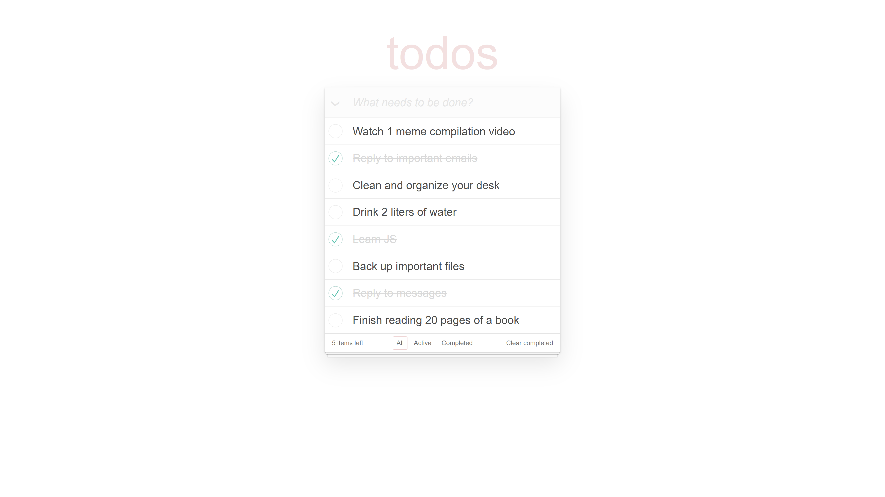

# React Todo App

A clean, type-safe todo manager — create, edit, filter, and sync your tasks against a
REST API, with optimistic UI updates.

[Live Demo →](https://todo-app-so.netlify.app)



## Tech Stack

React 19 · TypeScript · Vite 8 · SCSS + BEM · Bulma · FontAwesome

## Features

- **Full CRUD** — create, inline-edit, toggle, and delete todos
- **Filtering** — view All / Active / Completed
- **Bulk actions** — toggle-all complete, clear all completed
- **Optimistic UI** — temp todo on create, per-item pending state on update/delete
- **Error notifications** — auto-dismissing messages on failed API calls

## Backend API

This repository is the **frontend only**. It consumes the Todo REST API:

👉 **<https://github.com/CyborgNinjaHat/todo-api>**

## Environment Variables

Copy `.env.example` to `.env` and set the API base URL.

| Variable        | Used by                    | Notes                                             |
| --------------- | -------------------------- | ------------------------------------------------- |
| `VITE_BASE_URL` | `src/utils/fetchClient.ts` | Base URL of the Todo REST API (no trailing slash) |

## Getting Started

```bash
npm install
cp .env.example .env      # then set VITE_BASE_URL
npm run dev               # http://localhost:5173
```

> Requires **Node 24**

## Scripts

| Script                  | Description                                |
| ----------------------- | ------------------------------------------ |
| `npm run dev` / `start` | Dev server with HMR (opens browser)        |
| `npm run build`         | Type-check (`tsc -b`) then build → `dist/` |
| `npm run preview`       | Preview the production build locally       |
| `npm run lint`          | ESLint + Stylelint                         |
| `npm run lint:fix`      | Auto-fix ESLint + Stylelint                |
| `npm run format`        | Prettier write (`format:check` to verify)  |
| `npm run typecheck`     | Type-check only (`tsc -b`)                 |
| `npm run fix-style`     | `format` + `lint:fix`                      |

## License

MIT © 2026 Artem
